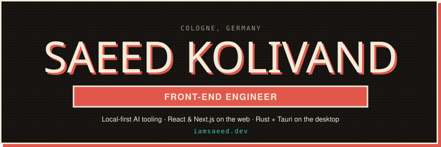
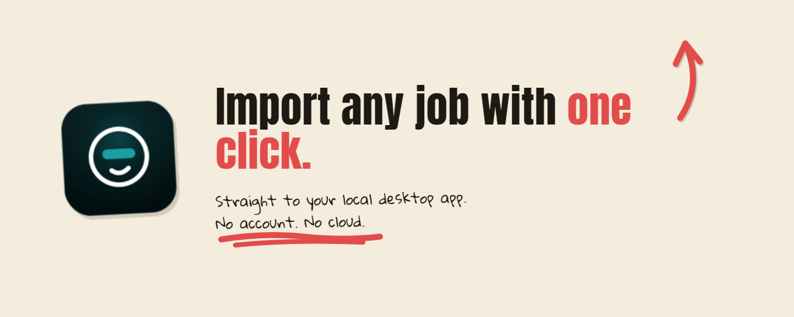
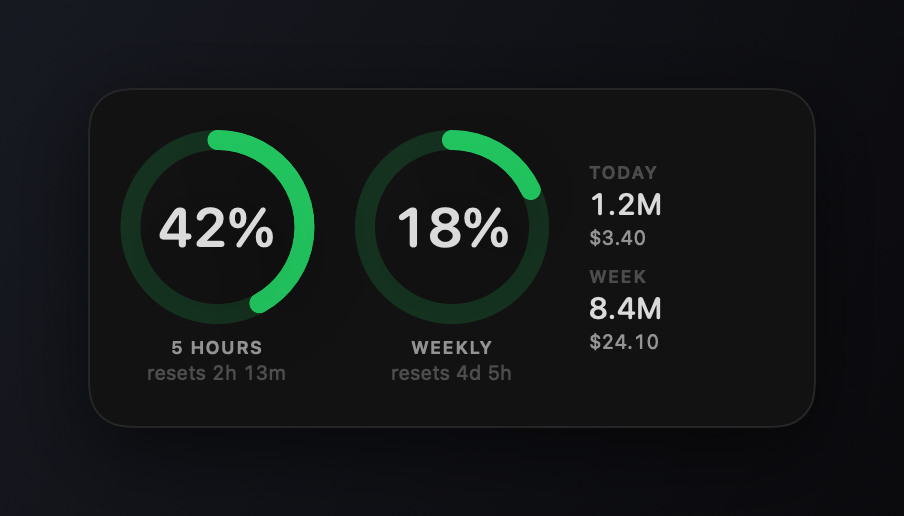
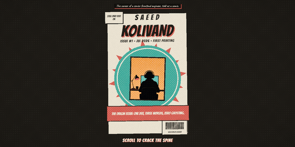
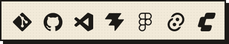

  

---

## 🗞️ The Work

**[ai-job-hunter-app](https://github.com/saeedkolivand/ai-job-hunter-app)** — a local-first AI job assistant: scrapes boards, matches roles against your résumé, writes the cover letter. Rust + Tauri desktop app with a browser extension. No account, no cloud, nothing leaves your machine.

<!-- A table, not two inline images: inline ones wrap onto separate rows as soon as the
     reader's window (or zoom) makes the content column narrower than both of them. -->
<table>
<tr>
<td width="50%" valign="top" align="center">

  
<b><a href="https://github.com/saeedkolivand/claude-usage-mac">claude-usage-mac</a></b> — Swift, SwiftUI and WidgetKit. Your Claude Code budget in the menu bar, before you hit the limit.
</td>
<td width="50%" valign="top" align="center">

  
<b><a href="https://iamsaeed.dev">iamsaeed.dev</a></b> — the portfolio, as a comic book you scroll through. Next.js, Three.js and GSAP.
</td>
</tr>
</table>

---

## 📦 Featured Work

<!-- FEATURED:START -->
| Project | What it is | Stack | ★ |
| :-- | :-- | :-- | --: |
| **[ai-job-hunter-app](https://github.com/saeedkolivand/ai-job-hunter-app)** | Local-first AI desktop assistant that scrapes job boards, matches roles to your resume, and auto-generates resumes & cover letters… | Tauri · Rust · React | 53 |
| **[claude-usage-mac](https://github.com/saeedkolivand/claude-usage-mac)** | Claude Code usage in the macOS menu bar and as a desktop widget | SwiftUI · WidgetKit · Swift | 14 |
| **[claude-usage-streamdeck-plugin](https://github.com/saeedkolivand/claude-usage-streamdeck-plugin)** | Stream Deck plugin showing Claude session/weekly usage | Stream Deck · TypeScript · macOS | 13 |
| **[crosskit](https://github.com/saeedkolivand/crosskit)** | Framework-agnostic UI components. One behavior core, one stylesheet, adapters for React, Vue, Svelte and Angular. | React · Vue · Svelte | 10 |
| **[saeed-kolivand-portfolio](https://github.com/saeedkolivand/saeed-kolivand-portfolio)** | Interactive 3D scroll-driven portfolio | Three.js · WebGL · GSAP | 9 |
<!-- FEATURED:END -->

## 🚧 Currently Building

<!-- BUILDING:START -->
- **[ai-job-hunter-app](https://github.com/saeedkolivand/ai-job-hunter-app)** — Local-first AI desktop assistant that scrapes job boards, matches roles to your resume, and auto-generates resumes & cover letters… `Tauri · Rust`
- **[claude-usage-mac](https://github.com/saeedkolivand/claude-usage-mac)** — Claude Code usage in the macOS menu bar and as a desktop widget `SwiftUI · WidgetKit`
- **[saeed-kolivand-portfolio](https://github.com/saeedkolivand/saeed-kolivand-portfolio)** — Interactive 3D scroll-driven portfolio `Three.js · WebGL`
<!-- BUILDING:END -->

---

## 👨‍💻 About Me

**The origin issue.** Six years of front-end, most of it React and Next.js, on products people log into every day. Somewhere in there I stopped waiting for a ticket and started shipping my own things.

**Three worlds.** TypeScript on the web, Rust behind Tauri on the desktop, Swift when the Mac deserves something native. Same instinct every time: keep it local, keep it fast, leave the user's data on the user's machine.

**Zero ghosting.** Issues get answered, PRs get reviewed, releases ship. Currently in Cologne, Germany.

---

## 🛠️ Tech Stack

**Build**

**Ship**

---

## ⚡ Recent Activity

<!-- ACTIVITY:START -->
`2026-09-02` &nbsp; Opened PR [#1094](https://github.com/saeedkolivand/ai-job-hunter-app/pull/1094) in [ai-job-hunter-app](https://github.com/saeedkolivand/ai-job-hunter-app)

`2026-09-02` &nbsp; Pushed to `main` in [ai-job-hunter-app](https://github.com/saeedkolivand/ai-job-hunter-app)

`2026-09-01` &nbsp; Released [v0.145.2](https://github.com/saeedkolivand/ai-job-hunter-app/releases/tag/v0.145.2) of [ai-job-hunter-app](https://github.com/saeedkolivand/ai-job-hunter-app)
<!-- ACTIVITY:END -->

---

## 🎯 What I'm Working Toward

* Take the AI tooling from side project to something people depend on
* Go deeper on backend and system design, not just the client
* Contribute more to the open source I already use daily

---

## 🎸 Off the Clock

Guitar, story-driven games, photography, and a streaming setup that got out of hand.
Lately a lot of that time goes to ComfyUI — wiring up node graphs for image and video generation, mostly just to find out what the newest models can actually do.
My cat **Harley** reviews every pull request by walking across the keyboard. 😼

**Saeed** is pronounced `Sa` (like **Sa**turday) + `eed` (like n**eed**).

---

## 📊 By the Numbers

<!-- Generated daily by .github/workflows/readme.yml — no third-party card service to rate-limit us. -->

### Thanks for visiting 👋

