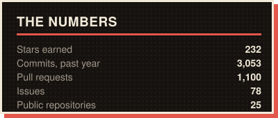
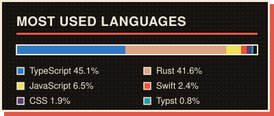
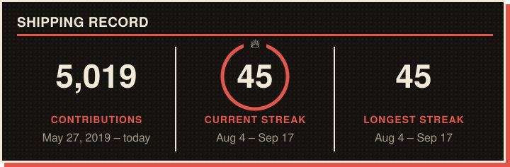

<div align="center">

# Hey 👋 I'm Saeed Kolivand

### Front-End Engineer · Cologne, Germany 🇩🇪

I build production React & Next.js apps — and local-first AI tooling for developers.


<br/>

[](https://iamsaeed.dev)
[](https://www.linkedin.com/in/saeedkolivand)
[](mailto:saeedkolivand1997@gmail.com)

</div>

---

## 🚧 Currently Building

<!-- BUILDING:START -->
- **[ai-job-hunter-app](https://github.com/saeedkolivand/ai-job-hunter-app)** — Local-first AI desktop assistant that scrapes job boards, matches roles to your resume, and auto-generates resumes & cover letters… `TypeScript`
- **[saeed-kolivand-portfolio](https://github.com/saeedkolivand/saeed-kolivand-portfolio)** — Interactive 3D scroll-driven portfolio `TypeScript`
- **[claude-usage-mac](https://github.com/saeedkolivand/claude-usage-mac)** — Claude Code usage in the macOS menu bar and as a desktop widget `Swift`
<!-- BUILDING:END -->

## 📦 Featured Work

<!-- FEATURED:START -->
| Project | What it is | Stack | ★ |
| :-- | :-- | :-- | --: |
| **[ai-job-hunter-app](https://github.com/saeedkolivand/ai-job-hunter-app)** | Local-first AI desktop assistant that scrapes job boards, matches roles to your resume, and auto-generates resumes & cover letters… | TypeScript | 46 |
| **[claude-usage-mac](https://github.com/saeedkolivand/claude-usage-mac)** | Claude Code usage in the macOS menu bar and as a desktop widget | Swift | 13 |
| **[claude-usage-streamdeck-plugin](https://github.com/saeedkolivand/claude-usage-streamdeck-plugin)** | Stream Deck plugin showing Claude session/weekly usage | JavaScript | 11 |
| **[crosskit](https://github.com/saeedkolivand/crosskit)** | Framework-agnostic UI components. One behavior core, one stylesheet, adapters for React, Vue, Svelte and Angular. | TypeScript | 9 |
| **[saeed-kolivand-portfolio](https://github.com/saeedkolivand/saeed-kolivand-portfolio)** | Interactive 3D scroll-driven portfolio | TypeScript | 8 |
<!-- FEATURED:END -->

---

## 👨‍💻 About Me

```ts
const saeed = {
  location: "Cologne, Germany",
  website: "https://iamsaeed.dev",
  role: "Front-End Engineer",
  experience: "6+ years",

  stack: [
    "TypeScript",
    "React",
    "Next.js",
    "Node.js",
    "Rust",
    "Tailwind",
  ],

  currentFocus: [
    "Local-first AI developer tools",
    "Clean architecture & system design",
    "Testing at the right level",
    "Shipping, not scaffolding",
  ],
};
```

---

## 🛠️ Tech Stack

<div align="center">

**Build**


**Ship**


<!-- skillicons has no ComfyUI icon — using their own logomark, matched to the 48px icon height -->


</div>

---

## ⚡ Recent Activity

<!-- ACTIVITY:START -->
`2026-08-16` &nbsp; Pushed to `main` in [ai-job-hunter-app](https://github.com/saeedkolivand/ai-job-hunter-app)

`2026-08-16` &nbsp; Opened PR [#997](https://github.com/saeedkolivand/ai-job-hunter-app/pull/997) in [ai-job-hunter-app](https://github.com/saeedkolivand/ai-job-hunter-app)

`2026-08-16` &nbsp; Released [v0.136.2](https://github.com/saeedkolivand/ai-job-hunter-app/releases/tag/v0.136.2) of [ai-job-hunter-app](https://github.com/saeedkolivand/ai-job-hunter-app)
<!-- ACTIVITY:END -->

---

## 📊 GitHub Analytics

<div align="center">

<!-- Generated daily by .github/workflows/readme.yml — no third-party card service to rate-limit us. -->





</div>

---

## 🎯 What I'm Working Toward

* Take the AI tooling from side project to something people depend on
* Go deeper on backend and system design, not just the client
* Contribute more to the open source I already use daily

---

## 🎸 Off the Clock

Guitar, story-driven games, photography, and a streaming setup that got out of hand.
Lately a lot of that time goes to ComfyUI — wiring up node graphs for image and video generation, mostly just to find out what the newest models can actually do.
My cat **Harley** reviews every pull request by walking across the keyboard. 😼

**Saeed** is pronounced `Sa` (like **Sa**turday) + `eed` (like n**eed**).

<div align="center">

### Thanks for visiting 👋


</div>
